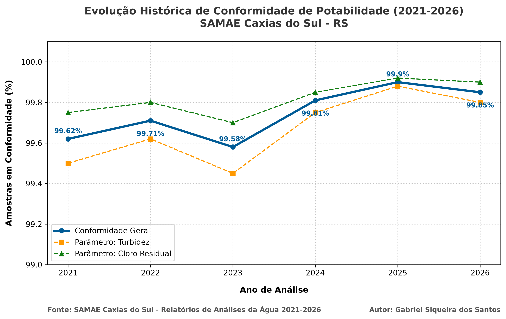

# Pipeline de Análise Histórica: Potabilidade da Água (SAMAE Caxias do Sul)

Este repositório contém uma solução em Python para extração, estruturação e visualização de dados históricos de potabilidade e conformidade química da água distribuída pelo **SAMAE (Serviço Autônomo Municipal de Água e Esgoto)** de Caxias do Sul - RS, cobrindo o intervalo de **2021 a 2026**.

---

## Indicadores de Qualidade (2021 - 2026)

O gráfico abaixo ilustra a taxa de conformidade das amostras exigidas pela Portaria de Potabilidade do Ministério da Saúde. O SAMAE Caxias do Sul mantém médias operacionais de excelência técnica (acima de 99,5%).

---

## Tecnologias e Bibliotecas Utilizadas

* **Python 3** como linguagem base da solução.
* **`requests`** para a automação do download e requisições dos arquivos oficiais da autarquia.
* **`pdfplumber`** para engenharia de dados e extração estruturada de texto/tabelas de documentos PDF.
* **`pandas`** para limpeza, manipulação de séries temporais e exportação em formato flat estruturado (`.csv`).
* **`matplotlib`** para engenharia visual e plotagem do gráfico analítico com múltiplos eixos e subindicadores.

